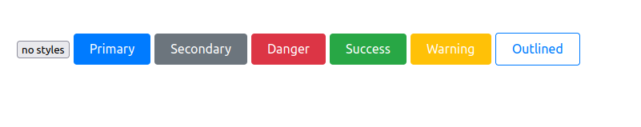
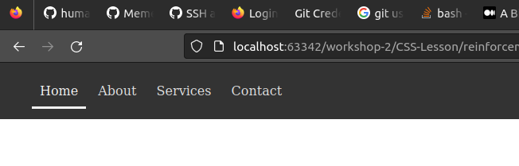
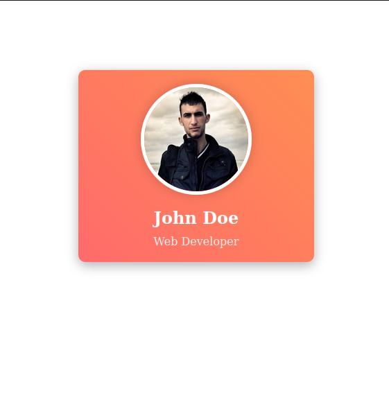
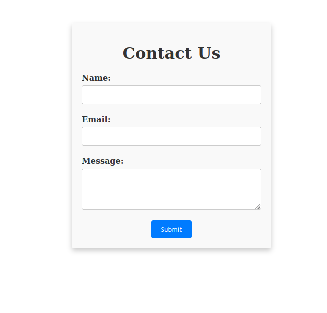

## Stylized Button Set
- **Description:** Create a set of buttons (e.g., primary, secondary, danger, warning, outlined) with distinct styles.
- **Skills Practiced:** Colors, borders, pseudo-classes (like `:hover :active`).
**Screenshot:**

## Link Styles:
- **Description:** Create an unordered list of links with distinct styles for the different states (e.g., link, visited, hover, active)
- **Skills Practiced:** Colors, borders, pseudo-classes (like `:hover :active :visited`).
**Screenshot:**

## Profile Card
- **Description:** Create a profile card with a picture, name, and description.
- **Skills Practiced:** Box model, borders, shadows.
- **Bonus:** Add a hover effect to the profile card.

**Screenshot:**

## Styled Form
- **Description:** Create a basic form with styled text inputs, labels, and submit button.
- **Skills Practiced:** Box model, borders, shadows, form elements.
**Screenshot:**
