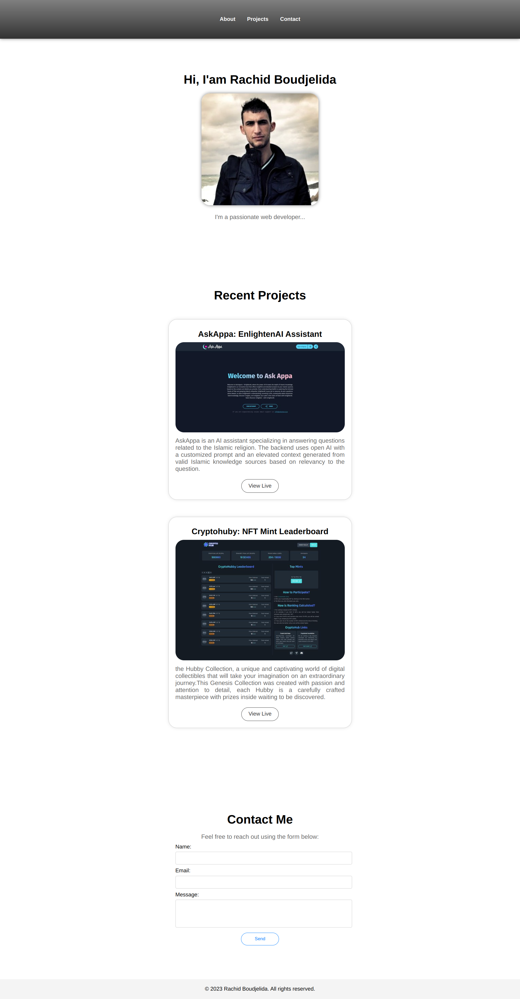

# Portfolio Project: CSS Basics

## Overview

In this project, you will demonstrate your mastery of CSS fundamentals by creating a web page about yourself. You will use your knowledge of CSS properties, selectors, and values to style your page.

## Steps

1. Create a new Folder on your Desktop called `portfolio`.
2. Open the `portfolio` folder in VS Code.
3. Create a new file called `index.html`.
4. Create a new file called `styles.css`.
5. Add the HTML boilerplate to your `index.html` file.
6. Use the `link` tag to link your `styles.css` file to your `index.html` file.
7. Add Content to your `index.html` file.
8. Add CSS to your `styles.css` file to style your page.

## Screen Shots
